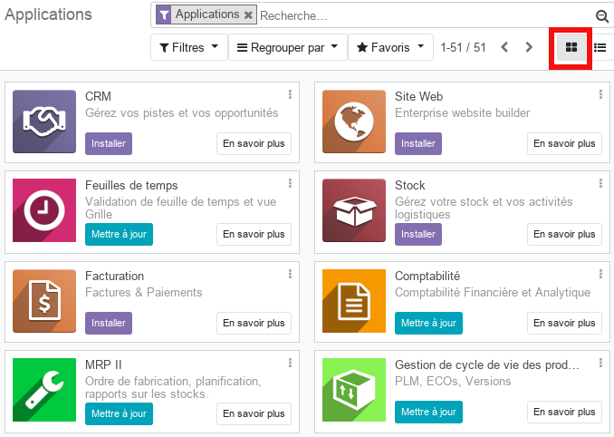
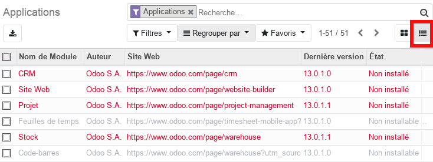
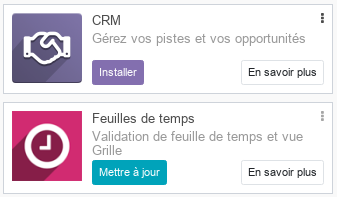

# Vue d'ensemble des Applications (admin)

Cette partie, **réservée aux adminstrateurs**, permet d'installer, de désinstaller et de mettre à jours les modules disponibles sur la platform odoo.

## Applications principales 

Cette vue en **kanban** donne accès à tous les modules disponibles pouvant être installés, et qui couvrent les différentes fonctions d'une entreprise, CRM, Stocks, Ventes, Achats, Ressources Humaines, ... 

Le mode **kanban** peut être rempplcé par le mode **liste** afin de visualiser plus de détails.

Sur chaque carte, représentant un module, on peut lire le **nom** et la **description**. Le boutton **_Installer_** permet d'installer le module et les modules avec un boutton **_Mettre à jour_** sont des modules de l'édition Entreprise (payant).

## Magasin de thèmes & Applis tierces

Ces menus donnent accès à des modules et des thèmes supplémentaires disponibles en lignes. Ces extensions ne sont pas toutes gratuites.

----
[Retour au sommaire](./odoo-usecases.md)

