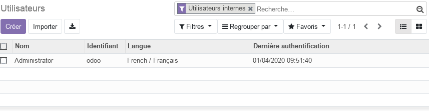
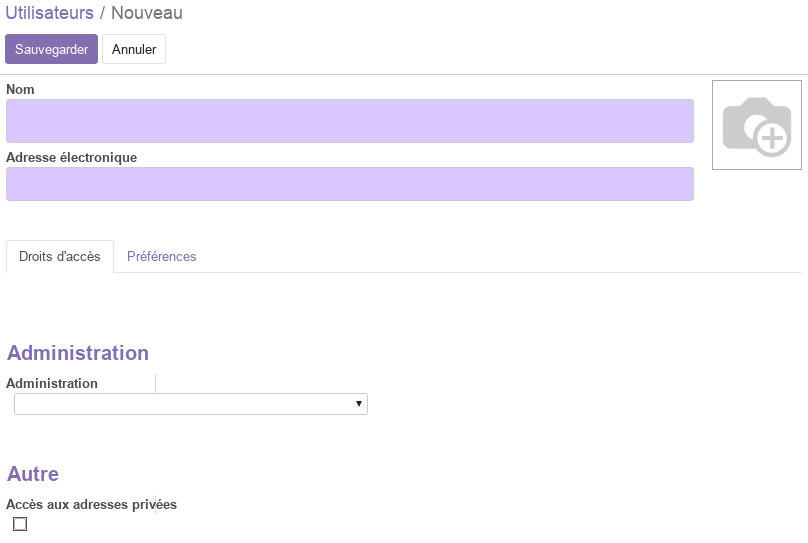
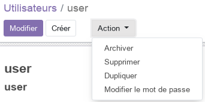
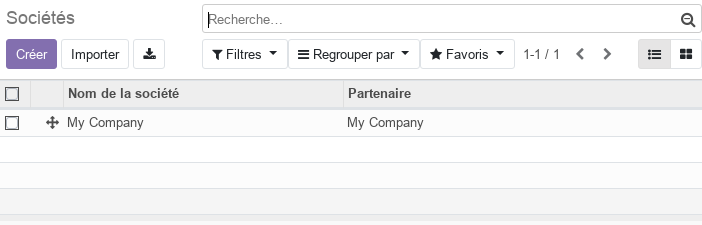
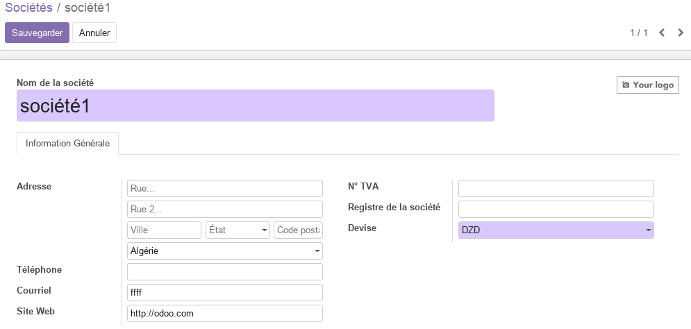
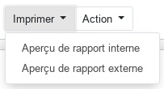

# Vue d'ensemble de la configuration (admin)

Cette partie, **réservée aux adminstrateurs**, permet de définir les paramètres communs les plus importants pour la personnalisation de la platform  odoo aux besoins de l'entreprise.

**Important** : de nouveaux menus/options peuvent être ajoutés à cette partie lorsque des modules sont installés. 

## Utilisateurs 
La partie utilisateurs permet de gérer les utilisateurs (ajout / supression / modification / archivage).

Pour créer un nouvel utilisateur, cliker sur **_Créer_**. 

Ainsi, vous pouver renseigner toutes les informations utiles.
- Nom, photo, email
- Droits d'accès aux modules installés
- Préférences (langue, signature, fuseau horaire)

Pour confirmer cliker sur **_Sauvegarder_**. Le nouveau utilisateur est ajouté à la liste.

Pour modifier le mot de passe de l'utilisateur, séléctionner le dans la liste et chosir le menu **_Action / modifier le mot de passe_**.

Le nouveau utilisateur peut maintenant se connecter et mettre à jour son profil dans [Préférences d'utilisateur](./odoo-user-preferences-fr.md).

## Sociétés
La partie sociétés permet de gérer les sociétés (ajout / supression / modification / archivage). Une société est une entité juridique autonome qui dispose de ses propres personnels, finances, ventes, ... 

Pour créer un modifier les informations de la société, séléctionner-la dans la liste et cliker sur **_Modifier_**. 

Ainsi, vous pouver renseigner toutes les informations utiles de votre société **qui apparaitrons sur les entêtes et pieds de pages rapports (documents) imprimés**. 

Pour avoir un aperçu des rapports, utiliser le menu **_Imprimer / Aperçu de rapprt externe_**.

----
[Retour au sommaire](./odoo-usecases.md)

