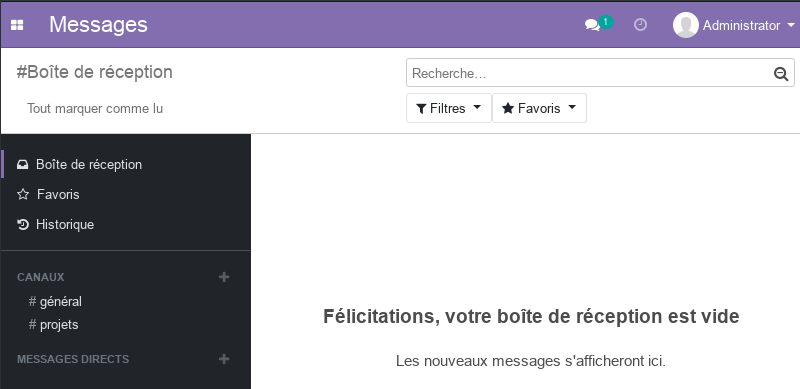

# Module Messages d'odoo

Ce document illustre les différentes fonctionnalités du module **Messages** d'odoo 13 community. 

Ce module basic permet d'améliorez la communication en équipe. Il permet de créer des canaux de discussions privées ou en groupe, intégrées avec tous les modules.

- Les canaux publics permettent de diffuser des informations à tous les employées et de recevoir/discuter les feedback afin d'apporter des éclaircissements si nécessaire.
- Les cannaux privés permettent aux équipes de discuter des sujets qui les concernent (projets, ventes, RH, marketing, ...)
- Les messages directes ne sont visibles que par les interlocuteurs.

Aussi, les messages sont intégrés à tous les modules odoo, ce qui permet de collaborer sur chaque sujet (facture, devis, employé, article, ...).

Pour plus de détails, consulter le [site officiel d'odoo](https://www.odoo.com/fr_FR/page/discuss).  

----
[Retour au sommaire](./odoo-usecases.md)