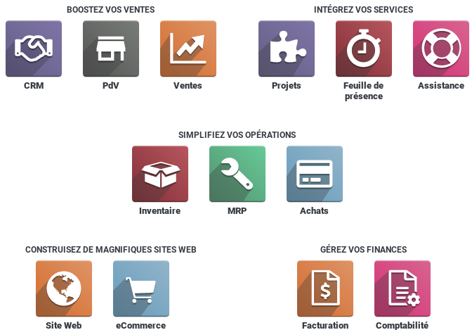

# Vue d'ensemble d'odoo (overview)

Odoo, anciennement OpenERP2 et Tiny ERP, est initialement un progiciel open-source de gestion intégré comprenant de très nombreux modules permettant de répondre à de nombreux besoin de gestion des entreprises (ERP), ou de gestion de la relation client (CRM). Le logiciel est utilisé par plus de quatre millions d’utilisateurs pour gérer leurs entreprises à travers le monde. Il existe une version community gratuite sous licence LGPLv3, et une entreprise sous licence propriétaire Odoo Enterprise Edition. [Wikipedia](https://fr.wikipedia.org/wiki/Odoo)

 [L'édition communauté](https://www.odoo.com/fr_FR/page/community) est un le noyau sur lequel sont implémentés les fonctionnalités de la version Entreprise. Pour plus de détail, consulter le [comparatif des éditions](https://www.odoo.com/fr_FR/page/editions).

 L'avanatge principale d'odoo est sont architecture modulaire permettant d'ajouter des moduels en fonction des besoins. La version communauté vient avec plusieurs modules standards permettant de gérer l'essentiel des activités d'une petite ou moyenne entreprise, tel que : les ressources humaines, les ventes, les achats, les stocks, les projets, la production, ...

 

 Aussi, plusieurs modules complémentaires, dévelopés par la [communauté odoo](https://odoo-community.org/), sont disponibles, offrant ainsi de nouvelles fonctionnalités aux utilisateurs.

L'autre atout majeur d'odoo est sa facilité de personalisation. En plus des fonctionnalités accessibles directement par l'interface utilisateur, la création de nouevaux modules est assez simple pour un developeur maitrisant Python, Javascript et HTML.

----
[Retour au sommaire](./odoo-usecases.md)

