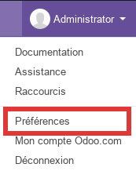
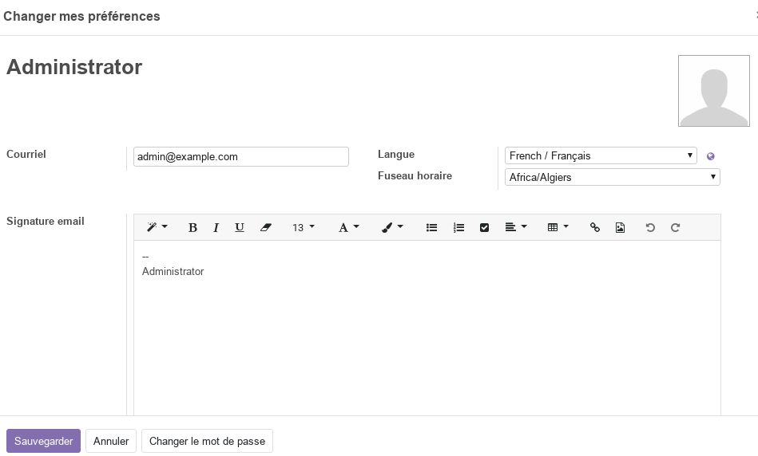

# Préférences d'utilisateur

Pour commencer à utiliser odoo il est préférable de commencer par mettre à jour vos préférences d'utilisateur (haut à droite).

Dans cette boite de dialogue vous pouvez renseigner les données suivantes :
- Nom
- Courriel (email)
- Langue d'interface
- Fuseau horraire
- Siganture (bas de page d'emails)
- et bien sure le **mot de passe**

----
Il importe de noter que dans **odoo** la notion d'utilisateur est séparée de l'employée. Généralement tous les employés ne sont automatiquement des utlisateurs. Toutefois, lorsque un utilisateur est un employé, les deux enregistrements sont liées.

Aussi, dans **odoo** un utilisateur externe (qui n'est pas un employé) peut avoir accès à certaines données (client, fournisseur, sous-traitant, ...).

**NB** : de nouvelles préférences peuvent être ajoutées à cette boite de dialogue lorsque des modules sont installés. 

----
[Retour au sommaire](./odoo-usecases.md)